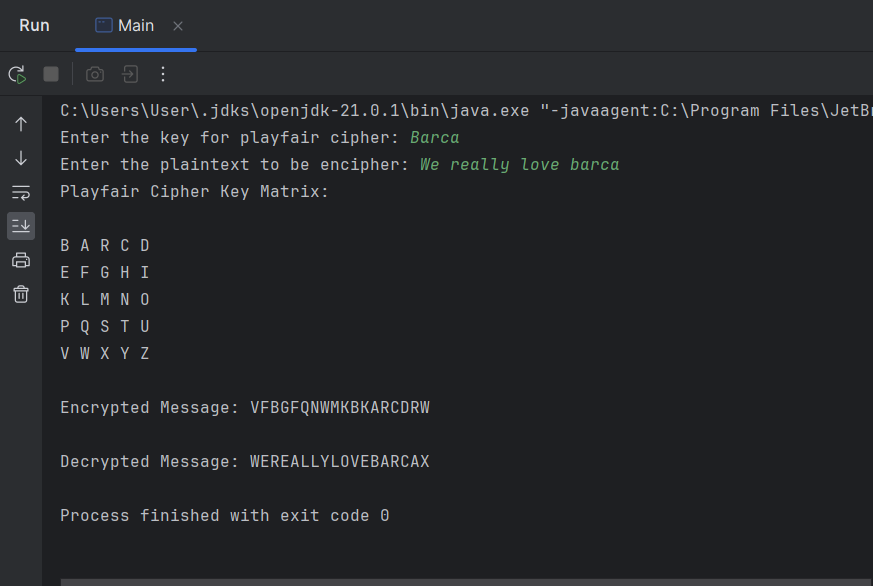

# Detyra e dytë nga lënda "Siguri e të Dhënave"

Në këtë repository gjeni implementimin e algoritmeve:
- Playfair Cipher (Substitution)
- 'Myszkowski Cipher (Transposition)

## Parakushtet

- Java Development Kit (JDK) të instaluar në sistemin tuaj
- Një IDE të përshtatshme të instaluar në kompjuterin tuaj

## Për fillim

1. **Clone the repository**:

   ```bash
   git clone https://github.com/lumii06/GR10_DataSecurity_Det2.git
2. **Navigoni për në direktoriumin e projektit**:

```bash
   cd GR10_DataSecurity_Det2
```
3. **Duke përdorur IDE tuaj egzekutoni algoritmin e dëshiruar duke bërë run**:

# Playfair Cipher:

Playfair cipher është algoritëm substituimi, i cili përor matricë të rendit 5x5. Ka logjikën e enkriptimit simetrik polialfabetik!
## Hapat që duhet ndërmarrë janë:
1. Krijoni keyword
2. Vendosni keyword në matricën 5x5
3. Plotësoni hapësirat e mbetura të matricës në rend alfabetik A-Z, duke mos i përsëritur shkronjat nga keyword (alfabeti duhet të jetë i formatit 26 shlronjësh pra të gjuhës Angleze)
4. Merrni Plaintext-in dhe ndajeni në diagrame me nga dy karaktere (relacionet e këtyre karaktereve në matricë tregojnë rregullat e enkriptimit)
5. Në qoftë se një diagram i caktuar përbëhet nga karaktere të njejta atëher duhet shtuar një karakter X si placeholder që të mos egzistojnë diagramet me karaktere të njejta.
   ### Rregullat e enkriptimit
   (Marrim XY si diagram shembull)
   Në qoftë se X dhe Y
      - Janë në të njejën kolonë => zëvendësojmë X me karakterin &darr; (poshtë) tij dhe Y ngjashëm.
      - Janë në të njejtin rresht => zëvendësojmë X me karakterin &rarr; (djathtas) tij dhe Y ngjashëm.
      - Krijojnë drejtëkëndësh => zëvendësojmë X me karakterin &rarr; (djathtas) tij në kufij të drejtëkëndëshit dhe Y me karakterin &larr; (majtas) tij në kufij të drejtëkëndëshit.
  * *Vëmendje: matrica është ciklike (në qoftë se karakteri X gjendet në kufij të matricës, ai zëvendësohet me karakterin në kufirin e kundërt në varësi të rastit).*
## Shembull i egzekutimit 



